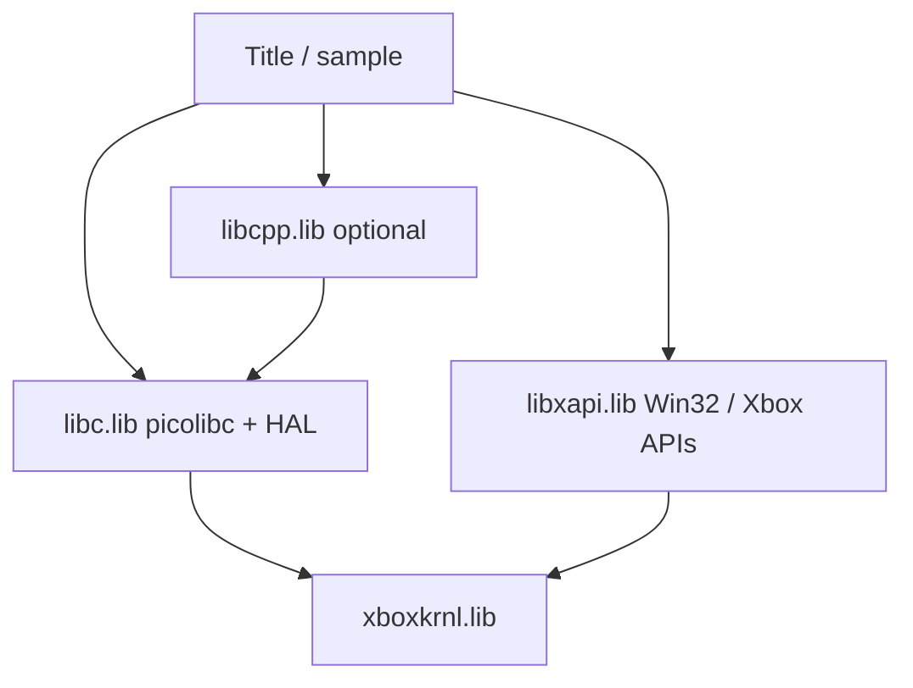

# libxapi — full xAPI port

> Living plan for xAPI work in RXDK-LibsZig. Supersedes earlier `libxbox*` naming.
> **Note:** the `kernel-*`, `hello-*`, `xapi-link`, and `xapi-standalone-link` smoke
> samples referenced below were retired in the tree cleanup — only `xapi-smoke` and
> `conformance-*` remain. Sections mentioning them are historical.

## Phase 1 package (`libs/libxapi/`)

The self-contained libxapi tree is the **build source of truth**:

- Public header: `libs/libxapi/include/xapi.h` → `zig-out/include/xapi.h`
- Internal code: `libs/libxapi/` (site, win32, nt, internal, k32, dll, rtl, uuid, usb, port, support)
- Build: root [`build.zig`](../build.zig) imports [`libs/libxapi/build.zig`](../libs/libxapi/build.zig)
- Legacy paths (`include/xapi/`, `build/xapi.zig`, `vendor/xbox_private/private/`) remain as reference copies

See [`libs/libxapi/README.md`](../libs/libxapi/README.md).

## Shipped library names

| Library | Output | Contents | Replaces (internal codename) |
|---------|--------|----------|------------------------------|
| **`libc.lib`** | `zig-out/lib/libc.lib` | picolibc + minimal libm + `src/xbox/` HAL adapters | `libxboxc` |
| **`libcpp.lib`** | `zig-out/lib/libcpp.lib` | LLVM libc++ + libcxxabi (freestanding) | `libxboxcxx` |
| **`libxapi.lib`** | `zig-out/lib/libxapi.lib` | Full xAPI / xapilib parity (k32, dll, rtl, uuid, USB merged) | `libxboxapi` |

**Zig build steps (target names):** `libc`, `libcpp`, `libxapi` (rename from `libxboxc`, `libxboxcxx`, etc. in [`build.zig`](../build.zig)).

Classic XDK analogues: `libcmt` → **`libc.lib`**, `libcpmt` → **`libcpp.lib`**, `xapilib` → **`libxapi.lib`**.

## Platform scope — Xbox only

**No Windows/desktop support.** The entire stack targets **original Xbox kit hardware** only:

- **One runtime environment:** retail/debug Xbox, PE subsystem 14, XBE deploy via `imagebld` — not Win32 desktop, not cross-host title execution.
- **LLVM triple `x86-windows-gnu`** is the PE/COFF link format for Xbox images, **not** “runs on Windows OS.”
- **Public headers** (`winbase.h`, `windef.h`, `xbox.h`) are the **Xbox XDK subset** — API names match the classic SDK, but implementations are Xbox-specific (FATX volumes, D:/T:/U:, USB OHCI, etc.). No general Win32 parity goal.
- **Porting rule:** When modernizing leak sources, **delete or `#if 0` desktop/Win32 branches** (e.g. `windows.h` fallbacks, POSIX shims for non-Xbox, `fix_non_posix_systems` patterns from stdtests). Do not maintain dual paths.
- **Validation:** kit ISO + serial/DbgPrint only. Host-side work is **compile/link smoke** on the dev machine, not running titles on Windows.
- **libc / libcpp:** Freestanding Xbox profile only (`-ffreestanding`, no threads, minimal libm). No MSVC redist, no UCRT, no desktop console assumptions beyond debug output.

This simplifies libxapi build flags (`build/generated/xapi_site.h`: `_XBOX`, `i386`, no desktop `_WIN32` feature gates unless a leaked source file still requires the define for Xbox code paths).

## Goal

Deliver **`libxapi.lib`** + public headers (`xtl.h`, `winbase.h`, `xbox.h`, …) with full xapilib parity, validated by ported **xapi-smoke** (27 tests).

**Parity status (closed):** a function-level audit against the original xapilib (246 public functions) found exactly one un-ported source file, `k32/xsndtrk.c` (soundtrack enumeration), now ported. Public-function parity is **246/246, zero missing**. `XGetAutoLogonFlag` is *not* part of the xapilib export surface (it was a non-gap). Remaining known limitation: moveable heap memory in `xapiheap.c` (`LMEM_FIXED`/`GMEM_FIXED` always on).

**Keep the C/C++ runtimes:** `libc.lib` and `libcpp.lib` stay. They are not replaced by xAPI.

**Keep the C/C++ runtimes:** `libc.lib` and `libcpp.lib` stay. They are not replaced by xAPI.

**Kernel access (simplified):** **`libc.lib`**, **`libcpp.lib`**, and **`libxapi.lib`** each call **`xboxkrnl` imports directly** via `include/xboxkrnl/`. There is no requirement that libc route HAL/syscalls through xAPI Win32 entry points.

```
Title / sample
    → libc.lib / libcpp.lib / libxapi.lib   (each may #include <xboxkrnl/xboxkrnl.h> where needed)
        → xboxkrnl.lib (import table)
```

Titles that use classic XDK APIs still link **`libxapi.lib`** for `CreateFile`, `Sleep`, `XInput*`, etc. Picolibc HAL (`write`, heap, `_exit`) uses **`DbgPrint` / other kernel APIs directly** in `src/xbox/` — same as `trace.c` / `startup.c` today.

## Architecture



**Diagnostic samples:** `kernel-smoke`, `kernel-api-*` are direct-kernel harnesses (libc/xapi optional).

## Title link order (target)

```
libc.lib + xboxkrnl.lib                           # minimal C (kernel-smoke style)
libc.lib + libxapi.lib + xboxkrnl.lib             # C title with XDK APIs
libc.lib + libcpp.lib + libxapi.lib + xboxkrnl.lib   # C++ title
```

Each archive may contribute kernel imports; the linker merges import tables into one PE image.

## libxapi headers (`include/xapi/`)

| Header | Role |
|--------|------|
| **`xapi.h`** | Umbrella — `xboxkrnl/xboxkrnl.h` + `xdk_bridge.h` (no `sdk/nt.h`) |
| **`xapip.h`** | Internal precompile (replaces leak `xapip.h`) |
| **`xapi_xtl.h`** | Minimal title surface for libxapi TUs (replaces `xtl.h`; still pulls staged `windef`/`winbase`/`xbox` **transitionally**) |
| **`xdk_bridge.h`** | Win32 typedefs when `winnt.h` is skipped via `NT_INCLUDED` |
| **`ntrtl.h`**, **`nt_bridge.h`**, **`ntos.h`** | Shadows for leak NT headers (USB / vendor ntos.inc) |

**Header migration:** Staged `include/xdk/` exists only until declarations move into `include/xapi/` (and generated stubs). **`include/xboxkrnl/`** is the shared kernel surface for libc, libcpp, and libxapi.

Build force-includes [`build/generated/xapi_site.h`](../build/generated/xapi_site.h) (Xbox profile macros). k32 TUs pull `xapi.h` through `xapip.h`.

## libc.lib and libxapi.lib

Both may import from **`xboxkrnl.lib`**. No libc → xAPI → kernel indirection.

| Component | Kernel use |
|-----------|------------|
| `src/xbox/hal.c`, `trace.c`, `startup.c` | Direct `DbgPrint` / kernel APIs via `include/xbox/kernel.h` → `xboxkrnl.h` |
| `libxapi` k32/dll/… | Direct kernel calls inside leak modules (same headers) |
| `OutputDebugStringA` | Implemented in **libxapi** k32 for titles; libc HAL does not require it |

Optional cleanup: drop `src/xbox/kernel.c` if nothing in libc still needs a local `OutputDebugStringA` stub.

## libxapi.lib internal slices

| Slice | Role |
|-------|------|
| xapi_k32 | Win32 + Xbox user APIs — **kernel calls live here** (includes XMem, physical/virtual memory, FP DPC helpers, debug strings, interlocked, files, sync, threads, …) |
| xapi_dll | Init, mounts, TLS, title startup, kernel export resolution, shutdown |
| xapi_rtl | Rtl heap/random |
| xapi_uuid | GUID defs |
| xapi_usb_* | ohcd, usbd, hub, mu, xid — merged in (not separate ship libs); USB pool alloc lives **inside usbd**, not a sidecar |
| xapi_sndtrk | Sound tracker (`xsndtrk.c`) — part of libxapi or sibling ship lib |

**No separate shim slice.** There is no `xapi_modern`, `xapi_gap_src`, or `src/xapi/*.c` sidecar module. RXDK-Libs gap behavior is implemented **inside the owning leak module** (edited in-tree under `vendor/…`), not as overlay wrappers.

### Gap work — fold into native modules (not shims)

| Former RXDK-Libs gap | Integrate into |
|----------------------|----------------|
| `XMemAlloc` / `XMemFree` | `xapi_k32` — `physical.c` / `virtual.c` / heap path |
| FP save/restore for DPC | `xapi_k32` or `xapi_dll` — next to existing FP/kernel touch points |
| `XGetAutoLogonFlag` / settings | `xapi_k32` or `xapi_dll` init path |
| Kernel export / delay-load table | `xapi_dll` — `xapiinit.c` / init, resolved once at startup |
| `USBD_AllocateMemory` / pool | `xapi_usb_usbd` — native allocator in usbd tree |
| Title shutdown / IDE cleanup | `xapi_dll` — termination path |
| COMDAT / delay-load helpers | Drop or inline only where leak object files still require them |

Port rule: **fix forward in the module source** (or a single forked file replacing one leak `.c`/`.cpp` in the manifest). Never a parallel “shim library” that titles could omit.

Pack via [`build/coff_lib.zig`](../build/coff_lib.zig) → `zig-out/lib/libxapi.lib`.

## Constraints

- **Xbox-only** — no Windows/desktop runtime or API parity (see Platform scope above)
- Full xapilib parity on kit (k32, dll, rtl, uuid, USB, xsndtrk)
- **No shim layer** — gap fixes are edits to native xAPI module sources; do not copy or recreate `vendor/src/xdk_xapi_*` or a separate `xapi_modern` slice
- USB merged into libxapi.lib, not standalone driver libs

## Modernization (Xbox-specific)

Because we are not preserving Windows portability:

| RXDK-Libs / leak pattern | Xbox-only approach |
|--------------------------|-------------------|
| `fix_non_posix_systems.h`, getopt, `windows.h` fallbacks | Omit — not built |
| Dual desktop/Xbox `#ifdef` in leak C++ | Keep Xbox branch only; delete the rest |
| RXDK `xdk_xapi_*` gap module | **Inline into k32 / dll / usbd** — see table above; no sidecar `.c` |
| Host stdtests / autotools matrices | Out of scope for libxapi; use xapi-smoke on kit |
| `winbase.h` name | Keep header for SDK source compatibility; implementation is Xbox-only |

## Implementation phases

1. **Phase 0** — Vendor tree, `tools/xapi_manifest/`, `build/xapi.zig`, **Xbox-only** header staging (`xapi_site.h`); rename ship libs to libc/libcpp/libxapi
2. **Phase 1** — xAPI C slices compile (k32, dll, rtl, uuid); **gap behavior written into those modules** as compile fixes
3. **Phase 2** — Title samples link libxapi where XDK APIs are needed (libc/libcpp already use xboxkrnl directly)
4. **Phase 3** — USB C++ merge; **USBD pool alloc in usbd sources**
5. **Phase 4** — Ship + xapi-link smoke
6. **Phase 5** — xapi-smoke kit (27/27 passed on hardware; xinput + MU + savegame + soundtrack)

## Validation

| Artifact | Purpose |
|----------|---------|
| `zig build libc` / `libcpp` / `libxapi` | Ship archives |
| `zig build xapi-slices` | Compile-only xAPI slices |
| `zig build xapi-link` | libc + libxapi link smoke |
| `zig build xapi-standalone-link` | libxapi + minilib link smoke (no picolibc objects) |
| `samples/xapi-smoke/` | 27 kit runtime tests |
| `samples/xapi-standalone-link/` | libxapi + minilib link smoke (no libc) |

## Reference

[D:/Git/RXDK-Libs](D:/Git/RXDK-Libs) for behavior reference only; **do not copy** `vendor/src/xdk_xapi_*` — reimplement gap logic in the native module files under `vendor/…/xapi` and `vendor/…/dd/usb`.
